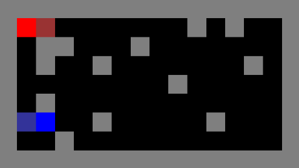

# lasertag-v0

This is an implementation of Google Deepmind's LaserTag-v0 game in [A Unified Game-Theoretic Approach to Multiagent Reinforcement Learning](https://arxiv.org/abs/1711.00832) based on [deepmind/pycolab](https://github.com/deepmind/pycolab). I'm implementing other games like **gathering**, **pathfinder** so wait for me to release all games in the paper.

# Install
```bash
cd lasertag-v0
pip install -e .
```

# How to use
```python
import gym
import lasertag

env = gym.make("LaserTag-small2-v0")
(p1_state, p2_state) = env.reset()

action = {"1": 0, "2": 3}

(p1_next_state, p2_next_state), reward, done, _ = env.step(action)
...
```

1. For `env.step`, action should be dictionary like above example.
2. State consists of both agents' partial observation state as a tuple with size 2
3. Reward is np.array([0, 0]) or np.array([1, 0]) or np.array([0, 1]). If agent '1' wins, np.array([1, 0]) else np.array([0, 1]).

## LaserTag-small2-v0


## LaserTag-small3-v0


## LaserTag-small4-v0


# Contribution
I'll appreciate any help, issue, pull request. Thanks!